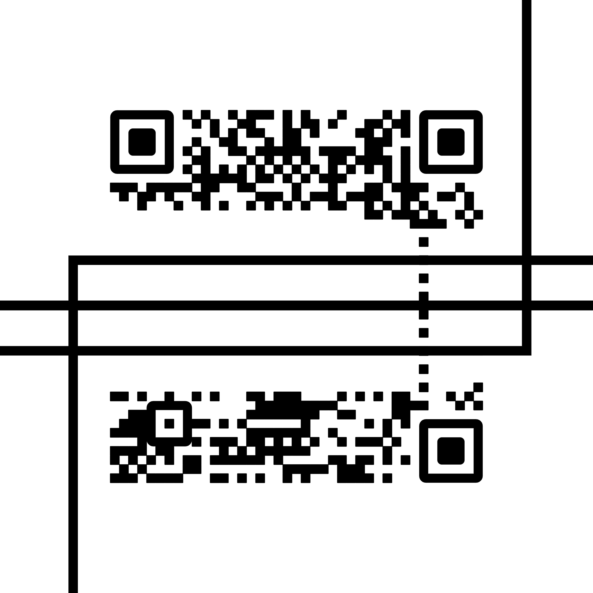
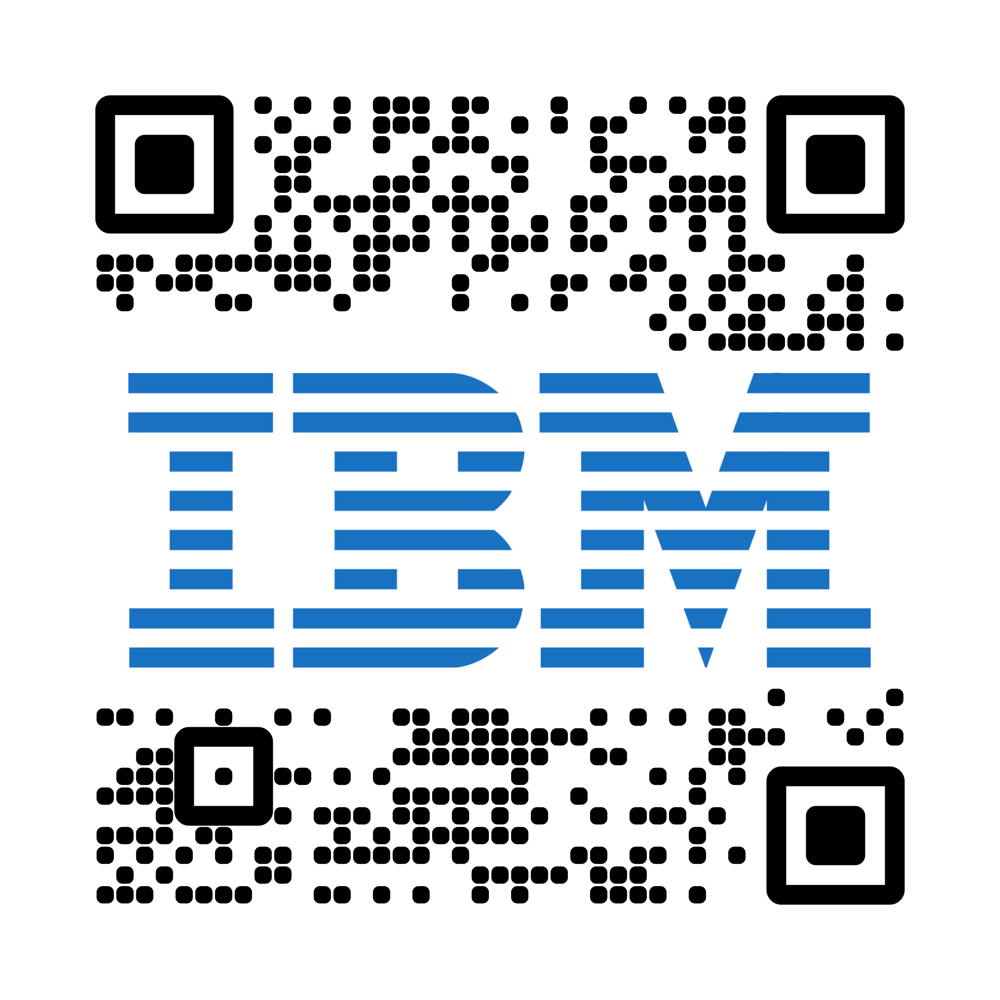
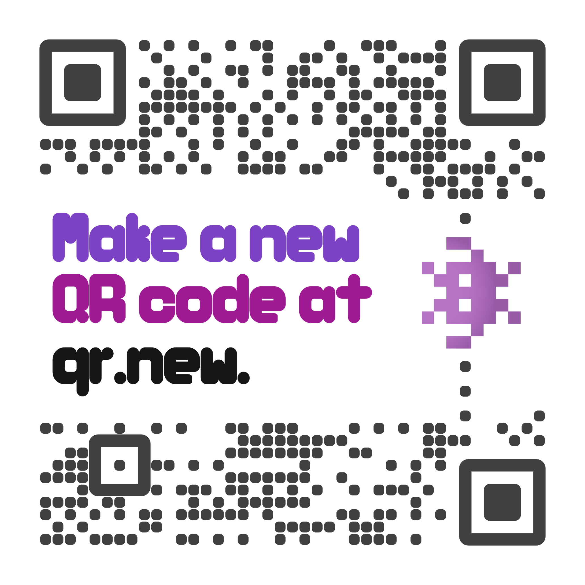
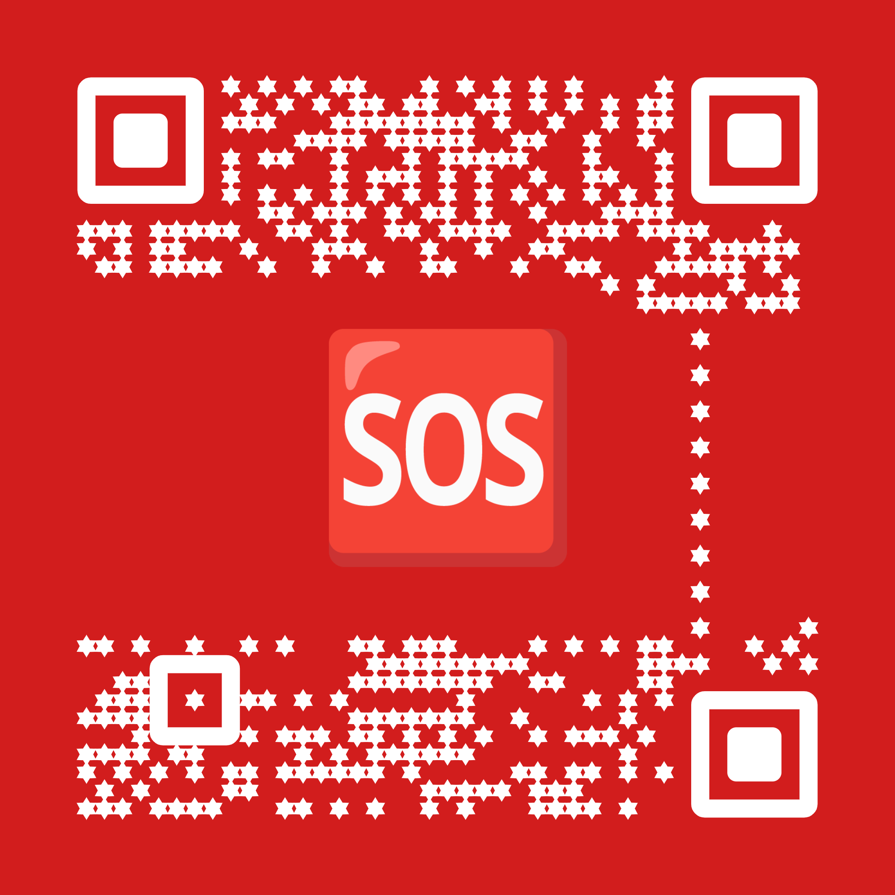
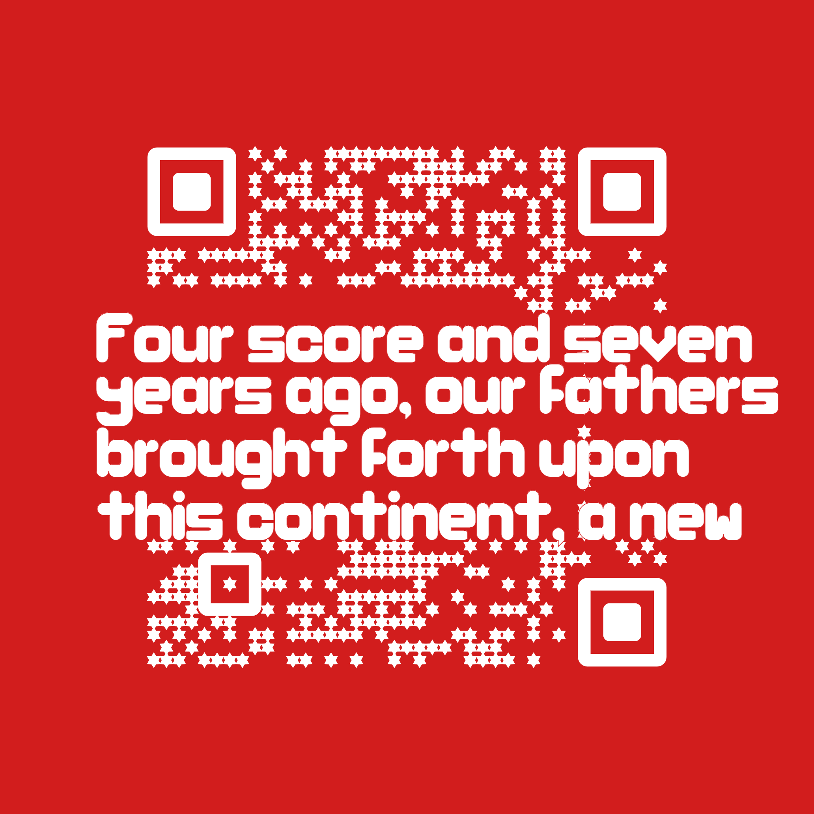
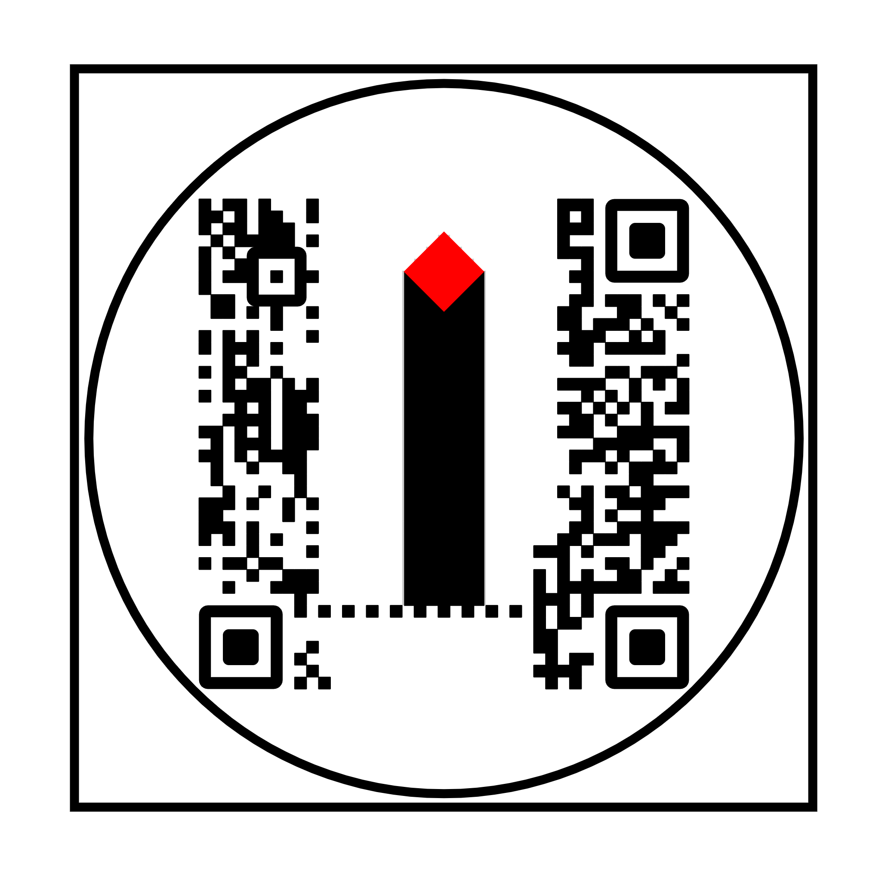
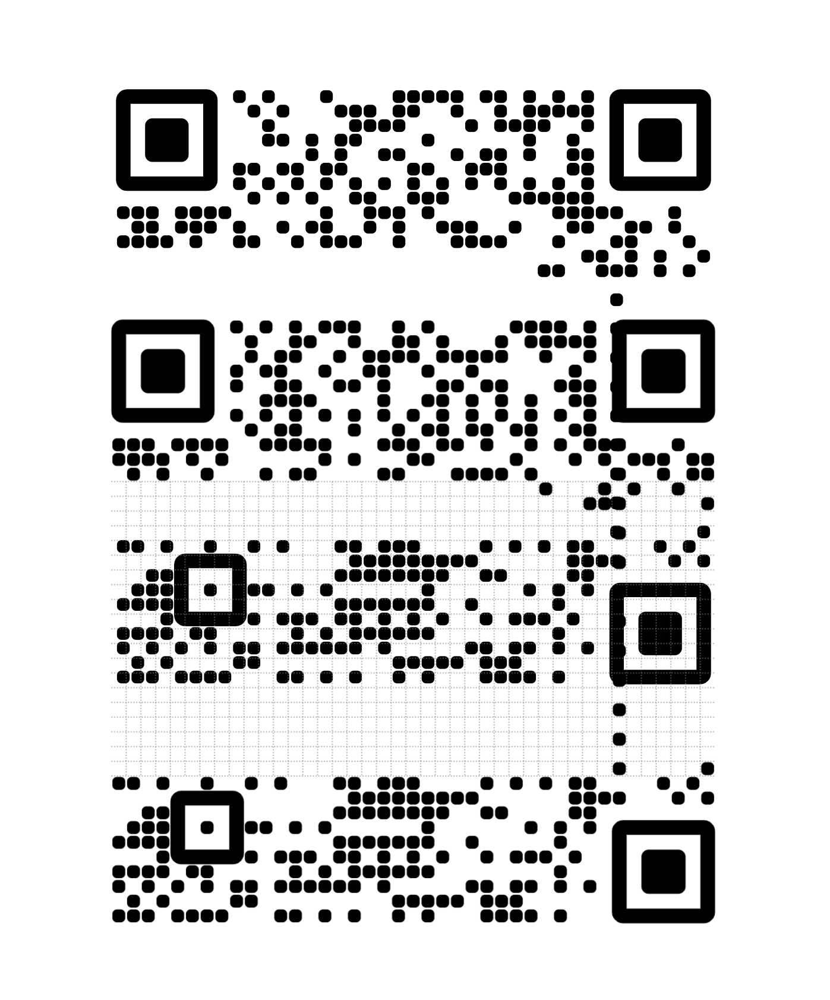

# Swink QR code designer

This is the design app for my failed startup, swink. You can use it to create QR codes that have arbitrary designs in the middle section, taking advantage of the error correction that QR codes use to deterministically turn some pixels in the code pattern on or off without affecting what the QR code is pointing to.

## Prerequisites

The designer is a Nuxt v2 app, statically generated. It had been part of a larger app that I have separated it from. There may be references to `sw.ink` and `qr.new` lying around; those were the domains I had that the app was being served from.

There are some prerequisites to making QR codes with the designer.

In order to maximize designer space, the url that the QR codes links to is expected to be exactly 25 characters long from the set of [alphanumeric characters](https://en.wikipedia.org/wiki/QR_code#Design) - `0–9, A–Z (upper-case only), space, $, %, *, +, -, ., /, :`

It is currently hardcoded to be `HTTPS://GITHUB.COM/KOCHRT`.

When I had the `sw.ink` and `qr.new` domains, it would direct to `HTTPS://SW.INK/${QR_ID}` where `QR_ID` would be a 10 alphanumeric-character long id set as part of the link shortening process.

If you want to change this you would do it in [components/Design/QRGroup.vue](components/Design/QRGroup.vue) at line 138.

## Installing and running

Node version 16 is expected.

```bash
> npm i
> npm run generate
> npm run start
```

## Examples









